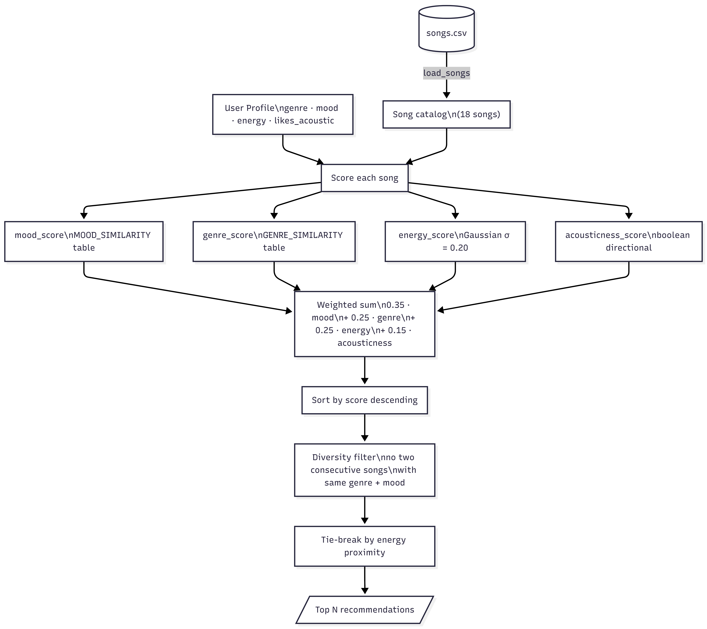

# 🎵 Music Recommender Simulation

## Project Summary

In this project you will build and explain a small music recommender system.

Your goal is to:

- Represent songs and a user "taste profile" as data
- Design a scoring rule that turns that data into recommendations
- Evaluate what your system gets right and wrong
- Reflect on how this mirrors real world AI recommenders

This version implements a complete content-based music recommender system in Python. It represents 18 songs as structured data, stores a user's taste as a preference profile (genre, mood, energy, acoustic preference), and scores every song in the catalog against that profile using a weighted formula. The result is a ranked list of recommendations with a score explanation for each one. The system also includes 9 user profiles — including adversarial edge cases designed to expose where the scoring logic breaks down.

---

## How The System Works

This system uses **content-based filtering** — it scores songs based on their attributes matched against a user's stored preferences. No other users' behavior is involved.

### Song Features

Each `Song` uses two types of features:

**Categorical** — describe identity and intent:
- `genre` — lofi, pop, rock, ambient, jazz, synthwave
- `mood` — chill, intense, happy, focused, moody, relaxed

**Numeric** — describe sonic character (all normalized to 0–1):
- `energy` — intensity, from calm to driving
- `acousticness` — organic vs. electronic/synthetic
- `valence` — emotional tone, from dark to uplifting
- `danceability` — rhythmic groove and movement

### User Profile

`UserProfile` directly mirrors the song features. It stores the user's preferred values, built by averaging feature values across songs the user has liked or listened to completion:

```
preferred_mood         = "chill"
preferred_genre        = "lofi"
preferred_energy       = 0.75
preferred_acousticness = True 
```

### How the Recommender Scores Each Song

Each song is scored individually against the user profile using two rules:

**Categorical features → similarity table** (partial credit for related categories, not binary 0 or 1):

Mood similarity — adjacent moods get partial credit:

| | chill | relaxed | focused | moody | happy | intense |
|---|---|---|---|---|---|---|
| **chill** | 1.0 | 0.7 | 0.4 | 0.2 | 0.1 | 0.0 |
| **relaxed** | 0.7 | 1.0 | 0.4 | 0.3 | 0.2 | 0.0 |
| **focused** | 0.4 | 0.4 | 1.0 | 0.2 | 0.1 | 0.1 |
| **moody** | 0.2 | 0.3 | 0.2 | 1.0 | 0.0 | 0.2 |
| **happy** | 0.1 | 0.2 | 0.1 | 0.0 | 1.0 | 0.3 |
| **intense** | 0.0 | 0.0 | 0.1 | 0.2 | 0.3 | 1.0 |

Genre similarity — structurally related genres get partial credit:

| | lofi | ambient | jazz | synthwave | pop | rock |
|---|---|---|---|---|---|---|
| **lofi** | 1.0 | 0.6 | 0.4 | 0.2 | 0.1 | 0.0 |
| **ambient** | 0.6 | 1.0 | 0.3 | 0.3 | 0.1 | 0.0 |
| **jazz** | 0.4 | 0.3 | 1.0 | 0.1 | 0.2 | 0.1 |
| **synthwave** | 0.2 | 0.3 | 0.1 | 1.0 | 0.4 | 0.2 |
| **pop** | 0.1 | 0.1 | 0.2 | 0.4 | 1.0 | 0.3 |
| **rock** | 0.0 | 0.0 | 0.1 | 0.2 | 0.3 | 1.0 |

```
mood_score  = MOOD_SIMILARITY[user.preferred_mood][song.mood]
genre_score = GENRE_SIMILARITY[user.preferred_genre][song.genre]
```

**Numeric features → Gaussian proximity** (rewards closeness to the user's preference, not just high or low values):
```
score(feature) = exp( -(song_value - user_preference)² / (2 × 0.20²) )
```
- At distance 0 → score = 1.0 (perfect match)
- Score falls off smoothly as the gap grows
- σ = 0.20 controls how forgiving the system is

**Acousticness → boolean directional score** (`likes_acoustic` is a bool, not a target value):
```
acousticness_score = song.acousticness        if likes_acoustic = True
                   = 1 − song.acousticness    if likes_acoustic = False
```
- `True` → rewards organic/acoustic songs
- `False` → rewards electronic/synthetic songs

**Weighted combination:**
```
total_score = 0.35 × mood_score
            + 0.25 × genre_score
            + 0.25 × energy_score
            + 0.15 × acousticness_score
```

| Feature | Weight | Scoring method | Reason |
|---|---|---|---|
| mood | 0.35 | similarity table | Captures current listening intent; cuts across genres |
| genre | 0.25 | similarity table | Structural sound preference, close behind mood |
| energy | 0.25 | Gaussian (σ = 0.20) | Strongest numeric separator in the dataset |
| acousticness | 0.15 | boolean directional | Cleanly separates organic from electronic |

### How Songs Are Chosen

Once every song has a score, the ranking rule builds the final list:

1. Score every song in the catalog
2. Sort by score descending
3. Enforce diversity — no two consecutive songs with the same genre + mood
4. Break ties by energy proximity
5. Return top N

### Full Flow


### Potential Biases

- **Mood dominates everything.** At 35% weight, a song with the right mood but wrong genre will rank higher than a song with the right genre but slightly off mood.
- **Acousticness is binary.** A user who slightly prefers acoustic songs is treated identically to someone who exclusively listens to acoustic music.
- **Tempo, danceability, and valence are ignored.** These features are stored on each song but never used in scoring — two songs with opposite valence look identical to the recommender.
- **Fixed user profile.** There is no learning or feedback loop. The same preferences are used for every recommendation regardless of what the user actually listens to.

---

## Getting Started

### Setup

1. Create a virtual environment (optional but recommended):

   ```bash
   python -m venv .venv
   source .venv/bin/activate      # Mac or Linux
   .venv\Scripts\activate         # Windows
   ```

2. Install dependencies

```bash
pip install -r requirements.txt
```

3. Run the app:

```bash
python -m src.main
```

### Running Tests

Run the starter tests with:

```bash
pytest
```

You can add more tests in `tests/test_recommender.py`.

---

## Experiments You Tried

### Standard Profiles — Does it work when everything lines up?

These three profiles test the basic case: a listener whose genre, mood, and energy all point in the same direction.

**Chill Lofi** — a listener who wants calm, acoustic lofi music at low energy.
The system gave exactly the right results. The top two songs were both lofi and chill, with the more acoustic one ranked first. Everything matched and the scores reflected it clearly.


---

**High-Energy Pop** — a listener who wants upbeat, electronic pop at high energy.
Again a clean result. Sunrise City (pop, happy, high energy) came out on top with a near-perfect score. The system correctly rewarded songs that matched on all three main dimensions.


---

**Deep Intense Rock** — a listener who wants loud, intense rock at very high energy.
Storm Runner scored 0.98 — almost perfect. Rock and intense mood aligned exactly. The system also surfaced a pop track (Gym Hero) in second place because its energy was a near-perfect match, even though the genre was off. This was the first hint that energy can sometimes matter more than genre.


---

### Adversarial Profiles — What happens when the preferences conflict?

These profiles were designed to push the system into tricky situations where no song can satisfy all four preferences at once. The goal was to see what the system does when it has to make a trade-off.

---

**Sad Headbanger** — a listener who wants metal music but is in a sad mood.
The problem: sad and aggressive are treated as completely unrelated moods, so mood gave zero points to every metal song. The system ended up recommending the right songs (metal and rock) purely because of genre and energy — but for the wrong reason. The mood preference was completely ignored.


---

**Acoustic Headbanger** — a listener who wants intense rock at very high energy but also prefers acoustic instruments.
The problem: almost every high-energy song in the catalog is electronic or electric, not acoustic. The system kept recommending the same loud rock songs as before, and the acoustic preference barely changed the rankings at all. When preferences contradict each other, the heavier weights win and the lighter one is drowned out.


---

**Lofi Minimalist** — a listener who wants lofi and chill, but prefers electronic over acoustic, and has a very specific energy target (0.385) that falls exactly between two equally good lofi songs.
The problem: both top songs matched mood, genre, and energy almost identically. The only thing that separated them was acousticness — even though that was only 15% of the score. Midnight Coding (less acoustic) came out first over Library Rain (very acoustic) purely because of that one flag. A tiny preference became the deciding factor.


---

**Romantic Metalhead** — a listener who prefers metal but is in a romantic mood, wants low energy, and likes acoustic instruments — basically the opposite of what metal sounds like.
The system recommended Ivory Rain (classical) as the top result instead of any metal song. Three out of four preferences (mood, energy, acousticness) pointed away from metal, so classical won even though metal was the stated genre preference. This shows that genre alone (25% weight) is not enough to override everything else.


---

**Tired Raver** — a listener who wants electronic music at very high energy but is in a serene, calm mood.
The problem: serene and energetic are treated as completely unrelated, so no high-energy song earned any mood points at all. The top results were purely driven by genre and energy. The system basically pretended the mood preference didn't exist — the same failure as Sad Headbanger, but in a different direction.


---

**Max Energy Seeker** — a listener who wants pop music at the absolute maximum energy (1.0).
No song in the catalog hits 1.0 energy, so every result is a partial match. Gym Hero (pop, intense, 0.93 energy) came first — which makes sense. But Storm Runner (rock, not pop) came second, beating out other pop songs because its energy of 0.91 was closer to 1.0 than theirs. A tiny energy advantage was enough to push a rock song above pop songs for a pop listener.


---

## Limitations and Risks

- **Tiny catalog.** With only 18 songs, many user profiles converge on the same top results. The diversity enforcement rule barely activates.
- **No user feedback loop.** Preferences never update — a user whose taste changes keeps getting the same recommendations forever.
- **Binary acoustic preference.** Can't express "I slightly prefer acoustic" — the flag is all or nothing, treating a casual preference the same as an absolute one.
- **Mood weight is aggressive.** At 35%, a mood mismatch can override genre, energy, and acousticness combined — producing counterintuitive results for edge-case users (see Sad Headbanger above).
- **Does not understand lyrics or context.** Two songs with identical feature values are indistinguishable, even if one is a lullaby and one is a workout track.

You will go deeper on this in your model card.

---

## Reflection

Read and complete `model_card.md`:

[**Model Card**](model_card.md)

Building this made me realise how much is happening behind something that feels effortless. The system turns your taste into four numbers, runs a formula, and returns a ranked list — but the results are only as good as the weights and what the catalog contains. Small changes in either completely change what you get. I was surprised by how often one song kept showing up across totally different listener profiles, not because it was a great match for anyone, but because it was average enough at everything to beat more specific songs that were missing one dimension. The most striking example was the Romantic Metalhead — a listener whose favourite genre was metal ended up with a classical song as their top recommendation. It showed me how much thought, testing and iteration goes into designing recommendation system that works well for all users.


---

## 7. `model_card_template.md`

Combines reflection and model card framing from the Module 3 guidance. :contentReference[oaicite:2]{index=2}  

```markdown
# 🎧 Model Card - Music Recommender Simulation

## 1. Model Name

Give your recommender a name, for example:

> VibeFinder 1.0

---

## 2. Intended Use

- What is this system trying to do
- Who is it for

Example:

> This model suggests 3 to 5 songs from a small catalog based on a user's preferred genre, mood, and energy level. It is for classroom exploration only, not for real users.

---

## 3. How It Works (Short Explanation)

Describe your scoring logic in plain language.

- What features of each song does it consider
- What information about the user does it use
- How does it turn those into a number

Try to avoid code in this section, treat it like an explanation to a non programmer.


The recommender reads your 4 preferences (genre, mood, energy level, and whether you like acoustic music), then goes through every song in the library and gives it a score based on how well it matches. Genre and mood aren't all-or-nothing — "lofi" and "ambient" are close enough to earn partial credit, while "lofi" and "metal" score zero. Energy is scored by how close the song's vibe is to your target. All four scores are combined into one final number per song, the top 5 are picked,

---

## 4. Data

Describe your dataset.

- How many songs are in `data/songs.csv`
- Did you add or remove any songs
- What kinds of genres or moods are represented
- Whose taste does this data mostly reflect

---

## 5. Strengths

Where does your recommender work well

You can think about:
- Situations where the top results "felt right"
- Particular user profiles it served well
- Simplicity or transparency benefits

---

## 6. Limitations and Bias

Where does your recommender struggle

Some prompts:
- Does it ignore some genres or moods
- Does it treat all users as if they have the same taste shape
- Is it biased toward high energy or one genre by default
- How could this be unfair if used in a real product

---

## 7. Evaluation

How did you check your system

Examples:
- You tried multiple user profiles and wrote down whether the results matched your expectations
- You compared your simulation to what a real app like Spotify or YouTube tends to recommend
- You wrote tests for your scoring logic

You do not need a numeric metric, but if you used one, explain what it measures.

---

## 8. Future Work

If you had more time, how would you improve this recommender

Examples:

- Add support for multiple users and "group vibe" recommendations
- Balance diversity of songs instead of always picking the closest match
- Use more features, like tempo ranges or lyric themes

---

## 9. Personal Reflection

A few sentences about what you learned:

- What surprised you about how your system behaved
- How did building this change how you think about real music recommenders
- Where do you think human judgment still matters, even if the model seems "smart"

